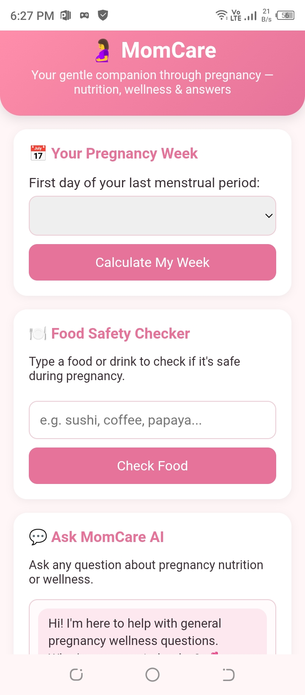
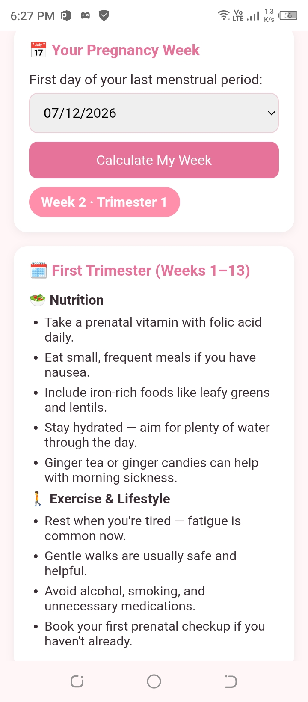
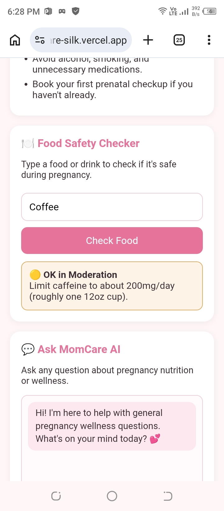
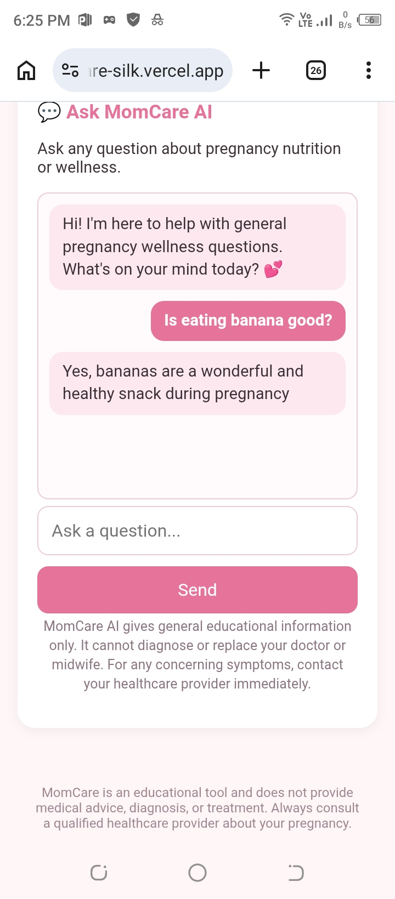

# MomCare 🤰 — Pregnancy Wellness Companion

## a. What it does & the problem it solves

Many pregnant women — especially first-time mothers, or women without easy access to a doctor for every small question — struggle to find quick, trustworthy, simple guidance on everyday questions like *"how far along am I?"*, *"is it safe to eat this?"*, or *"what should I be doing this month?"*.

**MomCare** is a web app that gives pregnant women a simple, friendly companion for everyday pregnancy wellness:
- It calculates their current pregnancy week and trimester from their last period date.
- It gives trimester-specific nutrition and lifestyle tips.
- It has a food-safety checker for common pregnancy food questions.
- It has an AI assistant for open-ended wellness questions, available any time of day.

This is aimed at **expecting mothers**, particularly those who want quick, everyday guidance between doctor visits — not a replacement for medical care, but a supportive daily companion.

## b. Live App

🔗 **Live URL:** _[PASTE YOUR VERCEL URL HERE after deployment, e.g. https://momcare-yourname.vercel.app]_

## c. Features

- 📅 **Pregnancy Week Calculator** — enter your last menstrual period date, instantly see your current week and trimester.
- 🥗 **Trimester-based Tips** — tailored nutrition and lifestyle advice for 1st, 2nd, and 3rd trimester.
- 🍽️ **Food Safety Checker** — type any food or drink and instantly see if it's generally safe, to be eaten in moderation, or best avoided, with a short explanation. Foods not in the built-in list are automatically checked with the AI assistant.
- 💬 **Ask MomCare AI** — a chat assistant for open-ended pregnancy wellness questions, with built-in safety rules (see below).
- 📱 Fully responsive, mobile-friendly design.
- ⚠️ Clear medical disclaimers throughout the app.

## d. The AI Feature

**Ask MomCare AI** is a chat assistant embedded in the app (and also used automatically by the Food Safety Checker for unknown foods). It is powered by **Google Gemini** (`gemini-1.5-flash`) through a secure serverless backend function, so the API key is never exposed to the browser.

**System prompt used (written by me):**

```
You are MomCare AI, a supportive pregnancy wellness assistant embedded inside the MomCare app.

Your role: give general, educational information about pregnancy nutrition, exercise, and healthy lifestyle habits.

Strict rules you must always follow:
1. You are NOT a doctor and must never diagnose, prescribe, or give specific medical treatment advice.
2. Never give specific medication dosages.
3. For anything that sounds like a medical emergency or concerning symptom (bleeding, severe pain, reduced baby movement, high fever, etc.), tell the user to contact their doctor, midwife, or emergency services right away — do not try to reassure or diagnose.
4. Keep answers short, warm, and easy to understand — 2 to 5 sentences unless the user asks for more detail.
5. Always be encouraging and calm in tone, never alarming, but never downplay real warning signs.
6. When relevant, gently remind the user to confirm important decisions with their own healthcare provider, but don't repeat this after every single message if it becomes repetitive — use natural judgment.
7. Stay strictly on topics related to pregnancy, maternal health, nutrition, and wellness. If asked something unrelated, politely redirect back to pregnancy wellness topics.
8. Never make claims about individual medical conditions since you cannot examine the user.
```

This keeps the assistant genuinely useful while staying safely educational rather than diagnostic.

## e. Tools, services & AI models used

- **Frontend:** Plain HTML, CSS, JavaScript (no framework — kept simple and fast)
- **Backend:** Vercel Serverless Function (`/api/chat.js`, Node.js)
- **AI model:** Google Gemini `gemini-1.5-flash` via the Generative Language API
- **Hosting/Deployment:** Vercel
- **Version control:** GitHub
- **Built with the help of:** Claude (Anthropic) as a coding assistant

## f. Screenshots

_[Add at least 3 screenshots here after you deploy — for example:]_

1. `screenshots/home.png` — Home screen with week calculator
2. `screenshots/tips.png` — Trimester tips card
3. `screenshots/foodchecker.png` — Food safety checker result
4. `screenshots/chat.png` — Ask MomCare AI conversation

Example markdown once you add the images to a `screenshots/` folder in your repo:
```md












```
## g. How to run this project

### Run locally
1. Clone the repo:
   
   git clone https://github.com/YOUR-USERNAME/momcare.git
   cd momcare
   ```
2. Install Vercel CLI (optional, for local testing of the API):
   ```
   npm install -g vercel
   ```
3. Add your Gemini API key as an environment variable named `GEMINI_API_KEY`.
4. Run:
   ```
   vercel dev
   ```
5. Open `http://localhost:3000` in your browser.

### Deploy your own copy
1. Push this repo to your own GitHub account.
2. Go to [vercel.com](https://vercel.com), sign in with GitHub, and import the repo.
3. In the Vercel project settings, add an Environment Variable:
   - **Name:** `GEMINI_API_KEY`
   - **Value:** your free API key from [Google AI Studio](https://aistudio.google.com/app/apikey)
4. Deploy. Vercel will give you a live public URL.

## ⚠️ Medical Disclaimer

MomCare is an educational tool only. It does not provide medical advice, diagnosis, or treatment, and is not a substitute for professional medical care. Always consult a qualified healthcare provider regarding your pregnancy.
